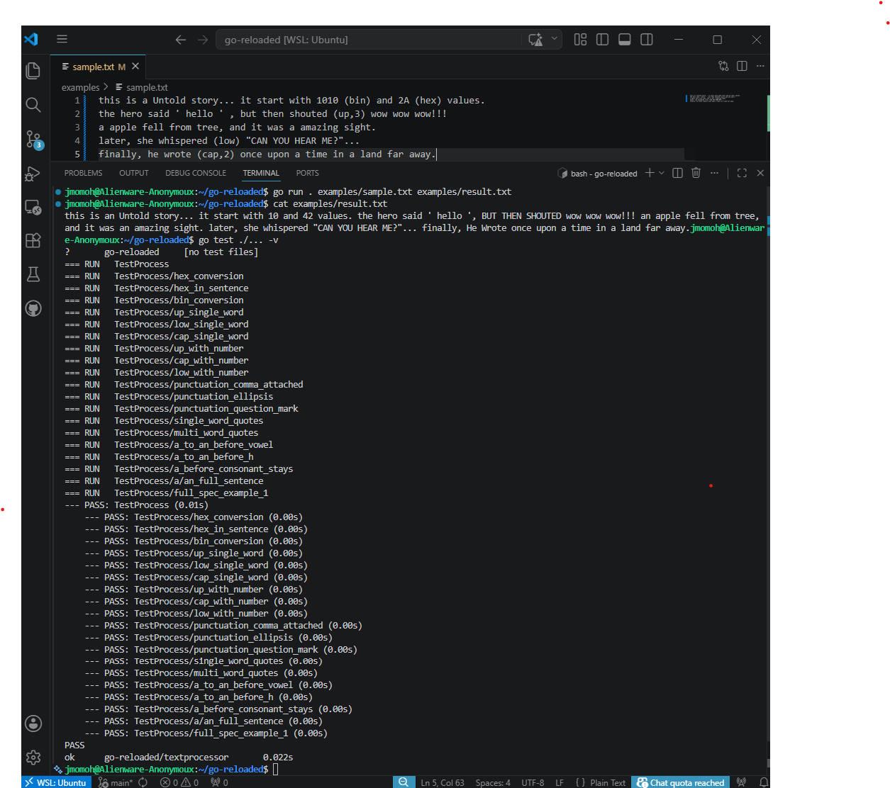

# Go Reloaded — Text Completion, Editing & Auto-Correction

[](https://golang.org/doc/)
[](https://github.com/jmomoh-source/go-reloaded/actions/workflows/ci.yml)

[](LICENSE)


A Go command-line tool for text processing, correction, and formatting.  
It reads an input file, applies automatic corrections (number conversions, case changes, punctuation normalization, quote formatting, article correction), and outputs a cleaned file.

---

## 🚀 Features
- **Hexadecimal → Decimal conversion**  
  Example: `42 (hex)` → `66`
- **Binary → Decimal conversion**  
  Example: `10 (bin)` → `2`
- **Case transformations** `(up)`, `(low)`, `(cap)` with optional counts `(up, N)`  
  Example: `Ready, set, go (up)!` → `Ready, set, GO!`
- **Punctuation normalization** (commas, ellipsis, question marks, etc.)
- **Quote formatting**  
  Example: `' word '` → `'word'`
- **Article correction**  
  Example: `a untold story` → `an untold story`

---

## 📂 Project Structure
```
go-reloaded/
├── .github/workflows/
│   └── ci.yml
├── docs/
│   ├── Project_Management.md
│   └── WALKTHROUGH.md
├── examples/
│   ├── sample.txt
│   └── result.txt
├── textprocessor/
│   ├── processor.go
│   └── processor_test.go
├── CODE_OF_CONDUCT.md
├── CONTRIBUTING.md
├── LICENSE
├── README.md
├── go.mod
└── main.go
```

---

## 🛠️ Usage
Run the program with an input and output file:

```bash
go run . examples/sample.txt examples/result.txt
cat examples/result.txt
```

---

## 🧪 Testing
Run all unit tests:

```bash
go test ./... -v
```

Tests are located in `textprocessor/processor_test.go`.

---

## 🤝 Contributing
See [CONTRIBUTING.md](CONTRIBUTING.md) for guidelines.  
Please also review our [Code of Conduct](CODE_OF_CONDUCT.md).

---

## 🎥 Demo
Here’s the tool in action:



---

## 📋 Project Board
Track progress and tasks on the [Project Board](https://github.com/jmomoh-source/go-reloaded/projects)

---

## 📚 Lessons Learned
- Importance of idiomatic Go practices  
- Writing maintainable APIs with clear documentation  
- Concurrency patterns for performance  
- CI/CD pipelines for reliability  

---

## 🔗 Resources
- [Go Documentation](https://golang.org/doc/)  
- Effective Go [(golang.org in Bing)](https://www.bing.com/search?q="https%3A%2F%2Fgolang.org%2Fdoc%2Feffective_go")  
- [Go Concurrency Patterns](https://blog.golang.org/pipelines)  

---

## 📌 Status
This project was built as part of my **Learn2Earn Fellowship** and demonstrates my ability to work with Go in a production‑style environment.